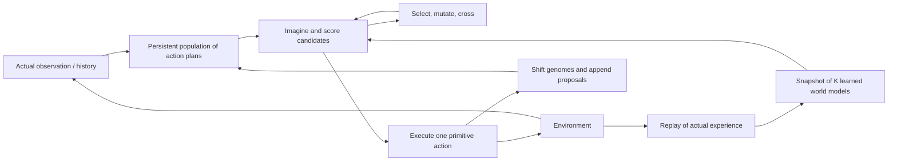

# RTGA: a living population of possible futures

Research and experiment plan · 5 September 2026 · Status: proposed; no implementation or experimental results yet.

Build the smallest complete loop: **persistent evolutionary plans → exploration → real experience → improved world models → better plans**. Start with a visible 2D environment, primitive actions, and three small models learned from scratch. Establish the loop before adding learned action compression, large visual models, or recursive hierarchy.

The first result to aim for is an agent that discovers an unfamiliar, learnable mechanism, becomes less curious about it as its predictions improve, and can subsequently use it to accomplish goals it was never trained to pursue. That tests more of the idea than either impressive movement with a perfect simulator or an agent endlessly visiting unfamiliar states.

All architecture choices, numeric starting points, and advancement gates below are proposals. Published findings are linked beside their claims. This is a focused literature review, not a claim of exhaustive coverage or historical priority.

## What the literature gives us

The original controller has a close published relative: **rolling-horizon evolutionary algorithms (RHEA), specifically with a shift buffer**. The broader control framework is model predictive control: optimize a future sequence, act briefly, observe again, replan. These connections give RTGA strong comparisons and reusable ideas while leaving its persistent, inspectable population as the center of this project.

| Work | Relevant evidence | How it changes this project |
|---|---|---|
| [RHEA, Perez et al., 2013](https://www.cmap.polytechnique.fr/~nikolaus.hansen/proceedings/2013/GECCO/proceedings/p351.pdf) | Evolves future action sequences for real-time game navigation; uses repeated-action macros. This version discards the unused sequence after acting. | A close planning ancestor; distinguish it from full population persistence. |
| [RHEA enhancements, Gaina et al., 2017](https://rdgain.github.io/assets/pdf/papers/gaina2017rhhybrids.pdf) | Explicitly shifts every individual's actions and appends a random legal action. Shift-buffer reuse helped across its game experiments. | The most direct reference for the original RTGA loop. |
| [iCEM, Pinneri et al., CoRL 2020](https://proceedings.mlr.press/v155/pinneri21a.html) | Improves sampling through temporally correlated actions, elite reuse, and shrinking populations. Retains a fraction of shifted elites between decisions. | Essential continuous-action comparison and a source of simple search improvements. |
| [PETS, Chua et al., 2018](https://arxiv.org/abs/1805.12114) | Learns probabilistic dynamics ensembles and plans through particle rollouts. Separates uncertainty about dynamics from stochastic outcomes. | Best starting reference for small state-vector world models. |
| [MAX, Shyam et al., ICML 2019](https://proceedings.mlr.press/v97/shyam19a.html) | Plans exploration using disagreement between predicted transition distributions. Its continuous experiments train exploration policies in imagination. | Closest to prospective ensemble curiosity; substitute the living RTGA population as the planning mechanism. |
| [Exploration via Disagreement, Pathak et al., 2019](https://proceedings.mlr.press/v97/pathak19a.html) | Uses bootstrapped prediction ensembles for exploration, including stochastic environments. | Start with this inexpensive disagreement signal; validate it before adding elaborate intrinsic objectives. |
| [PlaNet, Hafner et al., 2019](https://arxiv.org/abs/1811.04551) and [Plan2Explore, Sekar et al., 2020](https://proceedings.mlr.press/v119/sekar20a.html) | PlaNet plans online in recurrent latent dynamics. Plan2Explore learns an exploration actor using imagined disagreement, with lightweight predictors in a common representation. | A practical path to pixels and observation history. Preserve the distinction between learning an actor and planning at each real action. |
| [DreamerV3, Nature 2025](https://www.nature.com/articles/s41586-025-08744-2) and [TD-MPC2, ICLR 2024](https://arxiv.org/abs/2310.16828) | Strong general world-model agents. Dreamer learns behavior in imagination; TD-MPC2 performs latent trajectory optimization with learned reward/value structure. | Later system-level comparisons. A task-specific value representation is not automatically suitable for arbitrary future objectives. |
| [LeWorldModel, March 2026](https://arxiv.org/abs/2603.19312) | A roughly 15M-parameter, reward-free latent model trained from pixels with prediction and anti-collapse losses; uses latent MPC. Its experiments use offline datasets. | Promising compact visual-model branch. Cold-start online stability remains an experiment; the paper also reports difficulties on a very simple, low-diversity environment. |
| [V-JEPA 2, June 2025](https://arxiv.org/abs/2506.09985) and [Dreamer 4, September 2025](https://arxiv.org/abs/2509.24527) | V-JEPA 2 combines large-scale video pretraining with action-conditioned adaptation. Dreamer 4 demonstrates offline Minecraft learning with a large generative world model and trained behaviors. | Useful evidence of visual-model capability; their data regimes do not establish the desired small, cold-start agent. Fast generation of one future also does not imply cheap evolution of thousands of futures. |
| [Trajectory Autoencoding Planner, ICLR 2023](https://arxiv.org/abs/2208.10291) | Uses discrete VQ trajectory codes, a state-conditioned decoder, and a Transformer prior for planning from offline data. | A particularly close reference for learned action chunks; online discovery and population persistence are additional questions. |
| [SeCTAR, ICML 2018](https://proceedings.mlr.press/v80/co-reyes18a.html) and [Director, NeurIPS 2022](https://danijar.com/project/director/) | SeCTAR connects predicted trajectories to executable feedback skills. Director learns latent goals and a worker, and can visualize goals as images. | Separate action compression, state-dependent skills, and abstract dynamics. Each needs its own validation. |

Two results are especially useful checks on the ambition. [MAX's experiments](https://proceedings.mlr.press/v97/shyam19a/shyam19a.pdf) include an Ant Maze case where exploration did not yield successful subsequent task planning. [Exploring the limits of hierarchical world models, 2024](https://www.nature.com/articles/s41598-024-76719-w), found that its hierarchical variants at best matched a flat baseline, with abstract-model exploitation implicated. Neither result rules out RTGA; both tell us what to measure instead of assuming that exploration or abstraction automatically yields mastery.

Mario is a credible stretch target. [Burda et al.'s curiosity study](https://pathak22.github.io/large-scale-curiosity/resources/largeScaleCuriosity2018.pdf) reports a curiosity-only agent discovering 11 levels, secret rooms, and defeating bosses. The strongest result used 2,048 parallel environments and substantial training. That is encouraging evidence for curiosity, not a whole-game solution or evidence of inexpensive online learning.

## Start in the middle: the first complete agent

Use one small **2D curiosity laboratory**, built incrementally from three variants rather than a large game:

1. A moving puck with inertia, walls, and a target used only for planner diagnostics.
2. An unfamiliar switch/door mechanism, reached through a predictable corridor. This makes useful novelty require a sequence of actions through temporarily uninteresting states. Initially put it beyond one-step access but within the tested horizon under the puck's dynamics; verify reachability with the exact simulator. A later beyond-horizon variant tests a different limitation.
3. An action-triggered stochastic display or sensor alongside the learnable mechanism. This distinguishes learning about the world from repeatedly provoking randomness.

Begin with a declared low-dimensional observation containing physical state and observable mechanism states, and a small discrete action set: directional acceleration and no-op. Constants such as friction must be learned, not supplied as model parameters. Keep geometry fixed initially; add observed geometry and held-out layouts when testing generalization. Later remove velocity from observations to test memory, then replace vectors with pixels. Do not confound all three changes in the first experiment.

Make this first lab a continuing environment with no death or terminal reward. End recording at a fixed interaction budget without treating the recording boundary as a terminal event in imagined returns. Add episodic worlds only after specifying and comparing their reset semantics.

Implement a fast exact simulator for the environment and diagnostic planner. In the learned-model condition, the agent receives only actual observations, actions, and episode boundaries. It cannot call the exact simulator for hypothetical transitions, inspect hidden state, or read evaluator metrics. Check that boundary explicitly.

The initial agent has no external dataset, demonstrations, pretrained representation, actor, learned value function, or action tokenizer. It does need experience: an initial random exploration period and continuing online model training are part of the experiment, counted from the first real action.

Every strict curiosity run starts with fresh weights, replay, normalization, and population. Development on diagnostic goals does not supply learned state to those runs. Use matched initial random experience across paired comparisons, report whether warmup already encountered the mechanism, and retain all evaluation seeds rather than selecting favorable starting experience.



### Preserve plans, refresh predictions

At every decision:

1. Incorporate the new observation into state/history, and record the preceding actual transition.
2. Perform the scheduled model updates; freeze a model and representation snapshot for this decision.
3. Re-evaluate every inherited genome from the current observation under that snapshot.
4. Evolve until the configured evaluation budget or deadline is reached, preserving the best fully evaluated candidate.
5. Execute only its first primitive action. Shift every genome by one primitive time step and append a proposal.

Cached predicted states and fitness cannot generally survive that shift. Most individuals proposed a different first action from the one actually executed; even a perfect simulator therefore leaves them on counterfactual branches. Model training and changes in intrinsic scores also invalidate old evaluations. Keeping genes while refreshing evaluations preserves the temporal-selection idea.

Use tournament selection, modest elitism, point mutation, contiguous-segment mutation, and one-point crossover as an initial implementation. Treat crossover as a switch: mutation-only evolution is a serious comparison. For the literal reproduction, retain all shifted genomes; introduce partial retention and random immigrants as separate ablations.

The claim that distant actions receive more selection is plausible but contingent on survival and mutation. Record ancestry, age, replacement, and the number of evaluated generations contributing to surviving action segments; do not infer an individual gene's age merely from horizon length.

### Three models, with a testable notion of uncertainty

Start with three separately initialized small MLPs, independently bootstrapped from actual replay. Predict normalized continuous state changes with a bounded variance head; use categorical/Bernoulli heads for discrete mechanism events. Use balanced treatment of these heads so one observation dimension does not dominate curiosity merely because of its units.

For continuous predictions at the **same** state/action, let each member predict mean `mu_k` and covariance `Sigma_k`:

```text
epistemic proxy D(s,a) = mean_k ||mu_k(s,a) - mean_j mu_j(s,a)||²
aleatoric estimate    = mean_k Sigma_k(s,a)
```

The first measures disagreement about expected outcomes; the second describes variation each model expects within an outcome distribution. They are estimates, not calibrated truth. Members can agree and all be wrong. Bootstrap diversity and separate initialization help; [randomized prior functions](https://arxiv.org/abs/1806.03335) are a later ablation if unfamiliar regions produce unjustified agreement.

Use disagreement over categorical probabilities for discrete events. Normalize features from collected experience and freeze normalization during a planning decision. Ablate `K=1,3,5` at equal interaction and compute budgets: three is a reasonable starting cost, not an established optimum. With `K=1`, ensemble disagreement is identically zero; use it for model/control comparisons and separately name any replacement curiosity objective.

Critically, do not substitute spread between already-diverged trajectory endpoints for local disagreement. At each sampled imagined state, query all models on that same state/action. Evaluate these local scores along possible futures. Keep a sampled model identity fixed over each trajectory when treating it as a coherent dynamics hypothesis; use within-model stochastic particles when testing noisy dynamics. [PETS](https://arxiv.org/abs/1805.12114) motivates this separation.

### Keep the first objective literal

The first curiosity score is the discounted sum of local disagreement along the imagined trajectory. No distance-to-goal, coverage bonus, survival penalty, coins, or achievement rewards enter this condition. Put those in the evaluator. A separate explicit-goal mode demonstrates whether the same learned model is useful for control.

Maintain separate comparisons for mean task return, conservative task return such as mean minus a standard-deviation penalty, and optimistic return. These implement different attitudes toward predicted outcomes. Disagreement-seeking is an information objective; return variance is a risk objective. With only three members, empirical tail-risk estimates are coarse, and more stochastic samples do not create more independent epistemic hypotheses.

Raw prediction error is only known after observing an outcome. To use it in prospective planning, train an auxiliary predictor of recent realized error on actual replay and name that baseline explicitly. Otherwise compare reactive prediction-error curiosity separately. Do not give a baseline access to the environment's future states while calling it learned-model planning.

Only add corrective objectives when the initial experiment demonstrates a failure:

| Observed failure | Next controlled change |
|---|---|
| Repeatedly activates stochastic distraction | Distribution-aware disagreement; assess whether [aleatoric correction](https://proceedings.mlr.press/v162/mavor-parker22a.html) helps. |
| Revisits difficult states without learning them | Weight exploration by measured learning progress on reserved real transitions, following the motivation of [Oudeyer et al., 2007](https://www.pyoudeyer.com/ims.pdf). |
| Plans collect huge curiosity in impossible imagined states | Compare shorter trusted horizons, more thorough elite rescoring, and bounded/diminishing credit for repeated predicted novelty. |
| Cannot cross familiar space to reach novelty beyond its horizon | Add memory of visited frontiers or self-generated goals, then longer/coarser planning. |
| Forgets previously understood mechanisms | Mix recent replay with long-term replay and evaluate retention on a fixed historical probe set. |

There is a real tension here: unknown regions are precisely where the agent should collect data, while long rollouts inside unknown regions are unreliable. A useful later design is to plan toward an uncertain frontier and reassess after observing it, rather than collecting unlimited imagined reward beyond it. Hard exclusion of every uncertain state would destroy exploration.

Summed disagreement also does not model how an observation would update beliefs halfway through a plan. It can count the same potential discovery repeatedly. Diminishing credit is a heuristic; exact information gain would require belief updates within candidate futures. Keep that distinction visible.

## Build outward through experimental gates

| Stage | Work | Evidence needed before expanding |
|---|---|---|
| **0. Recreate the living planner** | Puck environment, exact-model RTGA, shifted population, deterministic replay, visible plan paths. | Controls the diagnostic tasks; selected action matches the evaluated genome; retained plans are rooted at the actual new state. Compare fresh and persistent evolution under equal budgets. |
| **1. Close the learning loop** | Three small online models; same planner, still using diagnostic goals. | Held-out multi-step prediction and actual goal-reaching improve with real experience. Compare exact-model and learned-model control to locate failures. |
| **2. Make curiosity productive** | Run fresh agents with disagreement; add corridor/mechanism/noise variants. | Planned curiosity improves meaningful coverage and later goal-reaching over random and one-step curiosity. Disagreement predicts subsequent learnable improvement on held-out probes; familiar mechanisms lose disagreement after learning and distraction does not dominate. |
| **3. Measure surprise** | Inject an impulse, relocate an obstacle, or change friction in separate conditions. | Quantify prediction surprise, plan disruption, and behavioral recovery. Determine when persistence helps and when fresh population members help. |
| **4. Learn proposals and allocate compute** | Context-conditioned retrieval of executed chunks; simple horizon/population adaptation. | Better success/coverage per decision time than primitive RTGA and simple action repeats. Gains survive equal elapsed-time horizons and charged training/retrieval costs. |
| **5. Learn one abstraction level** | Small VQ trajectory codec, primitive prefix plus latent tail, optional feedback skills and macro dynamics. | Codes execute predictably from held-out starts; long-range control improves at fixed compute without damaging local repair. |
| **6. Generalize observations and environments** | Memory, pixel models, independent benchmark tasks; additional hierarchy only if useful. | The same interfaces work without hidden state or reward leakage; improvements transfer beyond the custom world. |

The first visible checkpoint is stage 0 plus the smallest learned-model control loop from stage 1. The central research result is stage 2; noise and surprise then stress-test it. Treat the later stages as branches unlocked by evidence, not features that must all be implemented before learning anything.

### The first comparison matrix

Start with a small, interpretable set; avoid a full factorial search.

| Question | Comparisons |
|---|---|
| Does evolution help? | Random shooting, fresh-population evolution, persistent RTGA; same simulator and objective. |
| Does population memory help? | Full retention, shifted elites plus new plans, fresh population. |
| Is crossover useful? | Mutation-only versus mutation plus crossover. |
| Does looking ahead improve exploration? | Random actions, one-step disagreement, multi-step disagreement RTGA. |
| Are models the limiting factor? | Exact simulator versus learned models for the same externally specified diagnostic task. |
| Is uncertainty useful? | Raw-error control, mean disagreement, distributional disagreement on the noisy variant. |
| Is RTGA competitive as an optimizer? | Categorical CEM for discrete actions; iCEM when adding continuous actions. |

Begin with three development seeds for debugging. For claims, freeze configurations and run at least ten independent evaluation seeds with paired environment seeds across methods; report all seeds, intervals, failure counts, and learning-curve area. Increase replication if uncertainty is too large to decide. Do not select the best animation as evidence.

After each exploration checkpoint, fork evaluation copies, freeze learning, and set goals withheld during collection: reach selected locations, operate a discovered switch, or traverse a doorway with appropriate velocity. Goals must be computable from the agent's declared observation or learned representation. Feed results only to the evaluator; discard evaluation experience before exploration resumes. Measure reachability, success, and path cost on familiar and held-out starts.

Use evaluator-only transition probes covering familiar deterministic motion, an unfamiliar learnable mechanism, and familiar stochastic outcomes. Compare disagreement with actual error and with improvement on held-out transitions after a collection/training block. Report predictive likelihood and discrete-event calibration as well as mean error. Fix reporting scales across checkpoints so normalization drift cannot manufacture apparent learning. Probe data and results must not enter training or action selection; report evaluation interactions separately from exploration interactions.

Count **all** real interactions, model training time, planning time, auxiliary model work, and hypothetical model transitions. Report both equal-interaction comparisons and end-to-end wall-time comparisons. A method should not appear superior simply because it secretly received more fitting or imagination.

## Make the interesting behavior visible

The viewer should support live observation and deterministic replay from the same event log:

- Actual world state beside translucent predicted paths, with individual model futures distinguishable.
- Population raster: rows are genomes, columns are future primitive time, colors are actions. Mark crossover, mutation, ancestry, and the executed first action.
- Predicted versus realized one-step transition; uncertainty and actual error drawn separately.
- A timeline of prediction surprise, first-action/prefix changes, population diversity, and recovery.
- Coverage and mechanism discovery, plus held-out prediction and goal-control curves.
- Decision latency and compute split among search, prediction, and learning.

Record surprise **before** updating models on the surprising observation. Separate three recovery times: how quickly state estimation catches up, how quickly the population changes its preferred action, and how quickly learning repairs a changed dynamics model. An impulse with a known simulator isolates planner recovery; an unknown friction change also tests model adaptation.

Do not intentionally impose a delay to make the agent look surprised. Preserve the natural behavior, measure it, and compare fixed mutation with surprise-triggered additional mutations/immigrants. Warm-started MPC research explicitly discusses disturbance recovery and the need for independent samples: [Williams et al., 2017](https://arxiv.org/abs/1707.02342).

## Extensions, with the main traps made explicit

**Action libraries and small sequence models.** Store actual executed chunks with their starting context, outcomes, and model versions. First retrieve similar-context 4- or 8-step sequences to seed some tails and segment mutations. Preserve random proposals. In a curiosity setting, yesterday's interesting action may now be boring; retain behavioral variety and rescore it against today's objective. A small state/history-conditioned sequence model can later replace retrieval. Action-only imitation can reproduce habitual loops; high temperature alone does not fix missing context. [Trajectory Transformer](https://trajectory-transformer.github.io/) provides a sequence-modeling reference, with a different offline-data setting.

**Variable horizons and compute.** First try separate horizon pools such as 16, 32, and 64 primitive steps. Raw cumulative curiosity cannot be compared across these lengths without bias toward more reward terms. One concrete design is to use the pools as proposal generators, then extend and rescore a few finalists to a common primitive horizon under a fixed continuation rule. Charge that work. Alternatively define a terminal-value objective explicitly; normalizing by length changes what the agent optimizes.

Adapt budget based on marginal improvement and first-action stability across independent samples, while retaining occasional longer probes. Population agreement can indicate premature collapse, and an unchanged tail does not establish that further search is useless. [RHEA's consolidated study](https://arxiv.org/abs/2003.12331) covers dynamic depth and interacting search choices; measure a simple rule before attempting a learned allocator.

**Variable durations and learned chunks.** Begin with `(action, duration)` genes, then retrieved raw chunks, then VQ codes. Use a primitive prefix, initially perhaps 8–16 steps, followed by an abstract tail. As a code approaches the prefix, decode it into primitive actions and evolve those before execution. Account for elapsed primitive time: a duration `d` advances discount by `gamma^d` and includes all intermediate objective contributions. Shift only one elapsed primitive step, not an entire macro token. Align crossover at compatible primitive-time boundaries.

Compression alone reduces search dimensions; it does not reduce simulation cost if every decoded primitive is still simulated. A macro world model must predict the outcome of the actual decoder/skill to make long-range simulation cheaper. Model duration, intermediate events, termination, and uncertainty as well as endpoints. Near-term primitive verification cannot recover a collision skipped inside a long committed action, so retain action-by-action replanning.

Define the macro curiosity objective separately. Stored curiosity returns become stale as the primitive ensemble learns. Rerolling all primitives recovers the current score but removes much of the simulation speedup. Either calibrate disagreement at the macro level as a new intrinsic objective, or fit/relabel a predictor of current primitive curiosity return and charge its upkeep. Do not silently treat macro endpoint disagreement as equivalent to cumulative primitive information gain.

VQ action codes, feedback skills, and abstract goals are different things. Identical button presses do different things at different positions and velocities. Try context-conditioned decoding; when needed, a latent skill should drive a state-feedback policy. Freeze/version the codebook and decoder while populations use them, and expand or re-encode surviving tokens when their semantics change. The [TAP](https://arxiv.org/abs/2208.10291) and [SeCTAR](https://proceedings.mlr.press/v80/co-reyes18a.html) references are particularly useful here.

Only add a further level after two-level planning beats longer/wider flat search and handles unseen combinations of learned skills. A code spanning `m` actions at each level represents `m^L` primitive steps after `L` levels; this is exponential represented duration, not a guarantee of reliable planning or learning. Track every level's prediction-versus-execution gap.

**Pixels and learned representations.** Start with a small shared encoder and recurrent latent model in the PlaNet/Plan2Explore style. Add a decoder for inspection if useful; run candidate search in compact latents. Independent encoders have unrelated coordinates, so their latent vectors cannot simply be subtracted for curiosity. Compare predictions in a common target representation, freeze/version targets for each decision, and evaluate shared perceptual blind spots. The LeWorldModel branch is worth trying after this: its reported compactness fits the project, but its offline coverage and low-diversity caveats matter here.

Large generative video models are later alternatives. In [Hansen and Wang's June 2026 study](https://arxiv.org/abs/2606.27326), data-coverage signals predict failures of a 350M-parameter visual world model and guide curiosity-based adaptation. The authors explicitly limit the evidence to their tested setting. Borrow the practice of checking whether uncertainty predicts real rollout failure; do not assume all hallucination is solved by more data.

## Minimal external interface and implementation shape

Keep the public contract close to the original aesthetic:

```python
agent = RTGA(observation_space, action_space, compute_budget)
action = agent.act(observation, is_first=False)
```

The agent remembers its previous observation/action, learns on receipt of the next observation, and clears episode-specific state when `is_first=True`. A thin adapter handles reset/termination and the final observation. An optional objective can be supplied for diagnostic/task mode. Strict curiosity mode receives no environment reward or diagnostic `info`. Space descriptions, timing, and episode boundaries are necessary interface metadata; an observation/action stream alone does not reveal all of them.

Use Python, NumPy, and PyTorch initially. Prefer a directly batched numerical simulator and batched model prediction over per-plan Python calls. Use the [Gymnasium interface](https://gymnasium.farama.org/api/env/) for adapters, preserving the distinction between termination and truncation. PyTorch's [vmap](https://docs.pytorch.org/docs/stable/generated/torch.vmap.html) can batch independent operations; benchmark [compilation](https://docs.pytorch.org/docs/stable/generated/torch.compile) only after the eager loop is correct. Use CPU first for the tiny state experiment, benchmark available accelerators, and choose larger hardware only from measured needs.

Suggested layout, not yet created:

```text
rtga/
  agent.py           # online lifecycle, persistent population, model snapshots
  planning.py        # candidate generation, selection, mutation, budgets
  models.py          # exact-model adapter and learned ensembles
  objectives.py      # explicit task scores and intrinsic scores
  replay.py          # actual transitions, bootstrap sampling, held-out splits
  envs/              # small lab and independent environment adapters
  trace.py           # populations, predictions, ancestry, timings
experiments/         # frozen configs, comparisons, evaluation runner
viewer/              # playback and live inspection of recorded traces
```

A starting configuration is `N=128`, `H=32`, `G=12`, `K=3`, three 2-layer 128-unit dynamics networks, roughly 1,000 random initial transitions, and a bounded update schedule. These are sweep seeds, not tuned recommendations. Cover substantially smaller horizons/populations too. Thirty-two steps mean 1.6 seconds only if actions occur at 20 Hz.

The nominal cost of one rollout per ensemble member is `N × H × G × K = 147,456` member transitions per decision, before extra stochastic particles, training, and final validation. Computing same-input disagreement at every branch state can add up to another factor of `K`; count actual evaluations. Use sampled carrier trajectories and additional elite validation if full branching is too expensive. Do not obtain speed by silently replacing epistemic disagreement with endpoint spread.

Support a reproducible fixed-evaluation mode and an actual deadline mode. In deadline mode, preserve an already evaluated incumbent, budget each next batch before launching it, and record misses; returning only after a large GPU batch completes is not a hard real-time guarantee. Measure median/p95/p99 end-to-end action latency with device synchronization. A 50 ms target is an initial experiment, not a performance promise. If simulation runs slower than real time, label it accordingly.

Test properties that could invalidate the research: shift/re-root correctness, environment-state isolation, terminal handling, objective time accounting, reproducible seeds, no oracle/metric leakage, coherent model snapshots, and identical scores for identical model members. Learning evaluation must use real held-out trajectories, not imagined data or transitions fitted moments earlier.

Document reset semantics in curiosity experiments. Ending a rollout, restarting the world, or suppressing rewards after death can alter incentives even without an explicit death penalty. For Mario, distance, coins, lives, and completion should stay evaluation-only in the strict condition, and any termination-derived shaping must be named. The large-scale curiosity study deliberately investigated this issue.

## Environment progression and the next concrete milestone

Use the custom lab for attribution, then an independent cheap benchmark such as [MiniGrid](https://arxiv.org/abs/2306.13831) for prerequisites and memory. A small pixel platformer or [Procgen/CoinRun](https://openai.com/index/procgen-benchmark/) is a bridge to Mario. [Crafter](https://danijar.com/project/crafter/) offers a parallel branch where achievements and dependencies make competence measurable. These are options selected by the next unresolved question, not a requirement to support every environment before Mario.

Deliver this in three reviewable checkpoints:

1. **First visible build:** RTGA steers the puck using an exact model with the living population visible; the smallest learned-vector model can replace that simulator in the same control loop.
2. **Central experiment:** planned disagreement discovers the mechanism beyond the corridor and loses interest after learning it. Compare random and one-step curiosity; freeze the resulting models and test new goals.
3. **Stress tests and report:** add the stochastic distraction, inject an unexpected impulse, and run the frozen multi-seed comparisons. Produce replayable traces alongside the learning and control results.

The central hypothesis is **whether planning for reducible uncertainty produces a reusable simulator quickly enough that planning through it becomes increasingly competent**. Persistent evolution is the mechanism to investigate; the live population makes the investigation unusually inspectable. We should extend horizon, memory, and hierarchy when they resolve measured limits of that loop.
