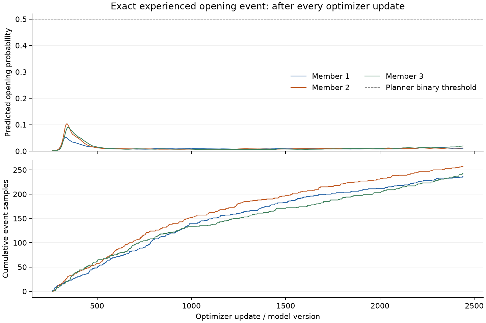

# 003 — Does the model acquire the opening event and then forget it?

The unchanged seed-0 random run never predicts its experienced opening event
with probability high enough to open the door in the planner. Recall rises
briefly, then weakens: this is not evidence that a correctly predicted opening
was acquired and later forgotten. It also is not a case of the event never
being sampled for training.

The event occurs at real step 327: from
`[0.24425199, 0.50491506, -0.05250541, 0.12295892, 0, 0]`, action `interact`
changes the door from closed to open. This exact state/action is the diagnostic
probe. Predictions are read after each individual optimizer update; the probe
is never inserted into replay or used to select actions. The naturally observed
event is retained once, like every other real transition.

| Quantity after the event was observed | Member 1 | Member 2 | Member 3 |
|---|---:|---:|---:|
| Highest predicted opening probability | 5.184% | 10.321% | 9.013% |
| Observed transitions at that peak | 392 | 400 | 408 |
| Final predicted opening probability | 1.075% | 1.171% | 1.960% |
| Updates with probability ≥ 50% | 0 | 0 | 0 |
| Event occurrences drawn in training batches | 236 | 257 | 243 |
| Updates whose batch contained the event | 219 | 239 | 228 |

The ensemble mean peaks at **7.985%**, during optimizer update 343 with 400 real
transitions observed, and finishes at **1.402%**. All **2,176 post-event optimizer
updates** were inspected. The 50% criterion is the actual threshold used for
binary coordinates in imagined rollouts, not a newly chosen success metric.
The final door-probability variance across members is `1.5742e-5`; small ensemble
disagreement therefore accompanies an incorrect prediction of this event.

The replay is exact: all 2,500 independently reconstructed real transitions,
all 625 original sampled trace records, and every final checkpoint field match.
All 24 parameter and optimizer tensors are identical, with zero maximum error.
The experiment uses source files matching the original core hashes, loaded from
an isolated snapshot of commit `5f6b89e`. The original configuration is unchanged:
256 random warmup steps, 200 initial optimizer updates, then eight updates every
eight real transitions, three members, and batches of 128 per member.

This check distinguishes event recall from visitation: the opening happened,
was stored, and repeatedly appeared in training batches. It does not identify
the relative effects of loss weighting, optimization, representation, or data
imbalance. Batch inclusion is measured; the event's individual gradient effect
is not. The initial rise also does not establish that the model learned a
general switch rule. This is one event in one continuing seed-0 run. Only one
closed-to-open transition occurs despite 52 recorded switch interactions.

No continuation or training-policy change was run. The full trajectory,
retained replay, per-update predictions and sample counts, final checkpoint,
source snapshots, and validation are in
[`results/003-event-recall`](../results/003-event-recall/).
The exact command and validation procedure are recorded in
[`COMMANDS.md`](../results/003-event-recall/COMMANDS.md).
