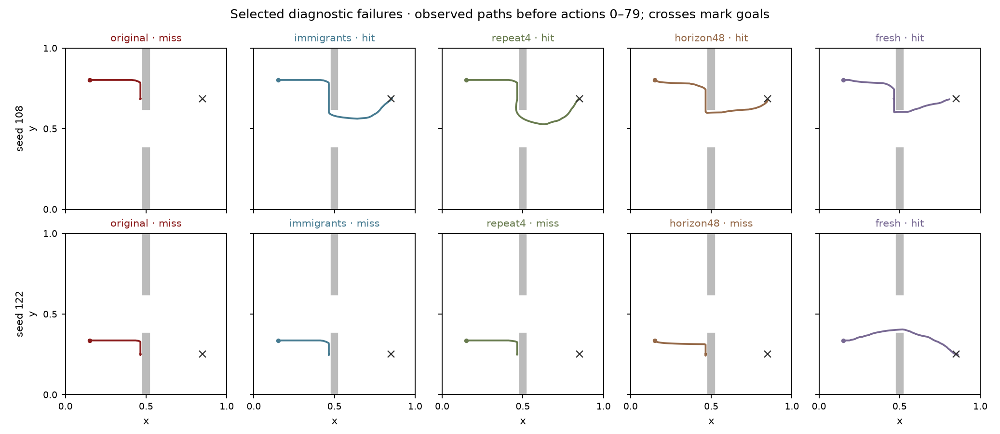

# 004 · Escaping a wall trap under a fixed simulation budget

A fixed exploratory follow-up to experiment 001. Exact dynamics, rooms environment, dense distance objective; no learning, curiosity reward, waypoints or changes to core planning/physics.

## Question and design

Does persistence preserve a poor route, and can fresh proposals or more lookahead repair it? Every condition uses 6,144 hypothetical transitions per decision and 80 real actions (491,520 transitions/run). Seeds 108 and 122 were deliberately selected from the earlier failures and are diagnostic, not representative. Seeds 0–9 are development; seeds 200–219, if present below, are a separate fixed confirmation set.

| Condition | Population × horizon × generations | Exact change |
| --- | --- | --- |
| Original persistence | 64 × 24 × 4 | Entire shifted population retained; random one-action tails. |
| 10% immigrants | 64 × 24 × 4 | Six random genomes replace non-elites after each of three offspring generations; no extra per-tick reset. |
| Repeated initialization | 64 × 24 × 4 | Four repeated primitive actions per sampled chunk in the first population only. Subsequent appended tails remain independent single actions. |
| H48 / N32 | 32 × 48 × 4 | Twice the horizon and half the population; default mutation probability changes from 1/24 to 1/48, and elite count from 6 to 3. |
| Fresh reference | 64 × 24 × 4 | Fresh population each decision, otherwise original genetic operators. |

Equal transition counts are not equal wall time: doubling sequential rollout length can cost more despite halving batch width. Longer horizons also change the averaging window of the same discounted-distance objective. This experiment tests these concrete configurations, not an isolated causal horizon effect.

## Diagnostic outcomes

| Condition | Success | Mean distance | Final distance | Restricted hit | Latency p50 /p95 ms | Failed seeds |
| --- | --- | --- | --- | --- | --- | --- |
| Persistent, original | 0/2 | 0.4314 | 0.3850 | 80.0 | 8.41 /8.76 | 108, 122 |
| Persistent, 10% immigrants | 1/2 | 0.3635 | 0.1930 | 70.5 | 8.47 /9.05 | 122 |
| Persistent, repeated initialization | 1/2 | 0.3554 | 0.1936 | 69.0 | 8.37 /8.70 | 122 |
| Persistent, H48 / N32 | 1/2 | 0.3900 | 0.1943 | 72.5 | 15.44 /15.86 | 122 |
| Fresh evolution | 2/2 | 0.3229 | 0.0191 | 64.0 | 8.43 /8.94 | none |

[Raw outcomes](../results/004-search-budget/diagnostic/results.json) include every run and distance/action/latency sequence.

## Development outcomes

| Condition | Success | Mean distance | Final distance | Restricted hit | Latency p50 /p95 ms | Failed seeds |
| --- | --- | --- | --- | --- | --- | --- |
| Persistent, original | 9/10 | 0.2640 | 0.0394 | 47.9 | 8.39 /8.95 | 8 |
| Persistent, 10% immigrants | 9/10 | 0.2688 | 0.0396 | 48.6 | 8.39 /9.43 | 8 |
| Persistent, repeated initialization | 9/10 | 0.2622 | 0.0392 | 47.8 | 8.38 /8.90 | 8 |
| Persistent, H48 / N32 | 9/10 | 0.2750 | 0.0401 | 49.4 | 15.44 /16.29 | 8 |
| Fresh evolution | 9/10 | 0.3048 | 0.0440 | 56.0 | 8.39 /9.15 | 8 |

[Raw outcomes](../results/004-search-budget/development/results.json) include every run and distance/action/latency sequence.

## Confirmation outcomes

| Condition | Success | Mean distance | Final distance | Restricted hit | Latency p50 /p95 ms | Failed seeds |
| --- | --- | --- | --- | --- | --- | --- |
| Persistent, original | 19/20 | 0.2502 | 0.0201 | 47.4 | 8.31 /9.08 | 217 |
| Persistent, 10% immigrants | 19/20 | 0.2507 | 0.0202 | 47.6 | 8.30 /9.23 | 217 |
| Persistent, repeated initialization | 19/20 | 0.2433 | 0.0203 | 46.6 | 8.25 /9.15 | 217 |
| Persistent, H48 / N32 | 19/20 | 0.2622 | 0.0071 | 48.5 | 15.20 /16.65 | 217 |
| Fresh evolution | 17/20 | 0.3056 | 0.0545 | 57.0 | 8.31 /9.18 | 206, 212, 217 |

[Raw outcomes](../results/004-search-budget/confirmation/results.json) include every run and distance/action/latency sequence.

## Frozen advancement decision

Gate passed: True. Diagnostic repairs: `{'immigrants': [108], 'repeat4': [108], 'horizon48': [108]}`. Development improvements: `[]`.

The advancement rule was stored before data collection. It required a persistent variant to repair a selected original failure, or improve development success without increasing mean distance. If passed, all five conditions were retained for one confirmation comparison; no tuning used confirmation outcomes.

## Paired confirmation effects

Effects are condition minus original persistence, paired by environment seed. 95% percentile intervals use 20,000 resamples of 20 seed pairs, NumPy seed 2026090504. Positive success differences favor the variant; negative distance/time differences favor the variant. Intervals are unadjusted for multiple comparisons. Restricted hit is min(first-success step, 80), with failed runs contributing 80; it is not a mean over successful runs alone. A [0, 0] bootstrap success interval can result when every pair has the same outcome and is not proof of identical population success probabilities.

| Condition | Δ success, pp | Δ mean distance | Δ final distance | Δ restricted hit |
| --- | --- | --- | --- | --- |
| Persistent, 10% immigrants | +0.0 [+0.0, +0.0] | +0.0005 [-0.0074, +0.0087] | +0.0002 [-0.0001, +0.0004] | +0.2 [-1.4, +1.8] |
| Persistent, repeated initialization | +0.0 [+0.0, +0.0] | -0.0069 [-0.0158, -0.0004] | +0.0003 [-0.0001, +0.0006] | -0.8 [-2.6, +0.6] |
| Persistent, H48 / N32 | +0.0 [+0.0, +0.0] | +0.0120 [+0.0004, +0.0219] | -0.0130 [-0.0402, +0.0008] | +1.1 [-1.4, +3.1] |
| Fresh evolution | -10.0 [-25.0, +0.0] | +0.0554 [+0.0409, +0.0724] | +0.0344 [+0.0047, +0.0815] | +9.6 [+7.1, +12.4] |

## Interpretation

The selected failure rescue did not become a higher observed success rate on new seeds: original persistence and all three variants reached 19/20 goals. Repeated initialization reduced mean distance by 0.0069 world units (variant-minus-original interval [-0.0158, -0.0004]), with no resolved improvement in first-hit time or final distance. This is a small unadjusted secondary effect, not a demonstrated general repair.

The H48/N32 configuration increased mean distance by 0.0120 and used 1.83× the median planning time. It did get closer to the goal on the shared failed seed 217, which helps explain its lower final-distance mean, but did not turn that approach into success within the fixed action budget. More lookahead is not free, and this width-for-depth exchange did not improve the overall primary outcome.

Fresh evolution reached 17/20 goals here, despite rescuing both selected old failures. Resetting the population can escape some routes and lose useful plans elsewhere. Keep the original planner as a comparison and preserve repeated initialization as a cheap ablation; this one comparison does not establish a replacement default. No further tuning or confirmation sweep was performed.

## Diagnostic paths and what they can establish



These are actual pre-action paths, with goals marked by crosses. A path stalled beside the wall shows an observed failure to find the doorway within 80 actions; it does not by itself prove genetic convergence or memory as the sole cause. The unchanged perfect simulator removes learned-model error as an explanation. Stored candidate paths allow the short-horizon prediction to be compared with the executed trail.

| Seed / condition | First success step | Longest wall-contact run | First observed crossing | Last observed position |
| --- | --- | --- | --- | --- |
| 108 / original | no hit | 59 | None | [0.465, 0.683403] |
| 108 / immigrants | 61 | 15 | 44 | [0.851547, 0.684558] |
| 108 / repeat4 | 58 | 7 | 39 | [0.849829, 0.683949] |
| 108 / horizon48 | 65 | 14 | 50 | [0.848394, 0.681746] |
| 108 / fresh | 78 | 15 | 62 | [0.807679, 0.681936] |
| 122 / original | no hit | 60 | None | [0.465, 0.250101] |
| 122 / immigrants | no hit | 59 | None | [0.465, 0.251827] |
| 122 / repeat4 | no hit | 60 | None | [0.465, 0.250522] |
| 122 / horizon48 | no hit | 57 | None | [0.465, 0.250425] |
| 122 / fresh | 50 | 0 | 32 | [0.859081, 0.243889] |

Wall contact uses the observed puck center at the collision boundary outside the traversable doorway. Trace diagnostics cover pre-action states 0–79; the outcome table includes the final 80th transition. Entropy in the raw diagnostics describes only the 24 stored score-ordered genomes, not full-population diversity. Compressed `.json.gz` traces and standalone HTML viewers are stored for both diagnostic seeds and preselected confirmation seeds 200/201.

## Provenance and limits

Each phase records its starting Git revision/dirty status, actual Python invocation and SHA-256 hashes of the exact runner, evaluator, planner and physics source. Other agents may change unrelated files concurrently; the runner refuses to mark a phase complete if its numerical sources change. These later runs do not modify experiment 001. Timing is descriptive on a shared machine and includes no learning or environment/trace I/O.

The exact numerical source is preserved in [source-snapshot](../results/004-search-budget/source-snapshot). Later changes to the live runner concern report wording; the archived file matches the recorded phase hashes.

Seven post-hoc explanatory replays preserve all five conditions on seed 217 and original/fresh on seed 206. Their actions and distances exactly match the existing confirmation records. These are not seven additional independent samples; the extra rendering runs used 560 real actions and 3,440,640 model transitions, separate from the comparison. [Replay ledger](../results/004-search-budget/confirmation/explanatory-replays.json).

### diagnostic

Run commit `5f6b89e1abb59de4d7e7f13ffb848b1e02446bae`; dirty at start: `True`. A dirty checkout is identified by source hashes, not the commit alone.

```json
{
  "command": [
    "/opt/homebrew/Cellar/python@3.12/3.12.11/Frameworks/Python.framework/Versions/3.12/Resources/Python.app/Contents/MacOS/Python",
    "-m",
    "rtga.horizon_study",
    "--phase",
    "diagnostic"
  ],
  "core_sha256": {
    "envs.py": "9883f95d36f3929cb61ca83eb0372550f0a082d8365fec5818f38121c8455956",
    "planning.py": "201f301fa74b340f72ce97d542cede37d389cc0ab79a3adf89c71c64ce52b36a",
    "experiments.py": "f47a9451894bf83341b9030ae3c8302589301123f20991a2c38f12ad552b2569",
    "horizon_study.py": "f93413b7b46dbfb900434fa73f1b41f3169dd236e1964ab60bd1692645bcafa3"
  }
}
```

### development

Run commit `5f6b89e1abb59de4d7e7f13ffb848b1e02446bae`; dirty at start: `True`. A dirty checkout is identified by source hashes, not the commit alone.

```json
{
  "command": [
    "/opt/homebrew/Cellar/python@3.12/3.12.11/Frameworks/Python.framework/Versions/3.12/Resources/Python.app/Contents/MacOS/Python",
    "-m",
    "rtga.horizon_study",
    "--phase",
    "development"
  ],
  "core_sha256": {
    "envs.py": "9883f95d36f3929cb61ca83eb0372550f0a082d8365fec5818f38121c8455956",
    "planning.py": "201f301fa74b340f72ce97d542cede37d389cc0ab79a3adf89c71c64ce52b36a",
    "experiments.py": "f47a9451894bf83341b9030ae3c8302589301123f20991a2c38f12ad552b2569",
    "horizon_study.py": "f93413b7b46dbfb900434fa73f1b41f3169dd236e1964ab60bd1692645bcafa3"
  }
}
```

### confirmation

Run commit `5f6b89e1abb59de4d7e7f13ffb848b1e02446bae`; dirty at start: `True`. A dirty checkout is identified by source hashes, not the commit alone.

```json
{
  "command": [
    "/opt/homebrew/Cellar/python@3.12/3.12.11/Frameworks/Python.framework/Versions/3.12/Resources/Python.app/Contents/MacOS/Python",
    "-m",
    "rtga.horizon_study",
    "--phase",
    "confirmation"
  ],
  "core_sha256": {
    "envs.py": "9883f95d36f3929cb61ca83eb0372550f0a082d8365fec5818f38121c8455956",
    "planning.py": "201f301fa74b340f72ce97d542cede37d389cc0ab79a3adf89c71c64ce52b36a",
    "experiments.py": "f47a9451894bf83341b9030ae3c8302589301123f20991a2c38f12ad552b2569",
    "horizon_study.py": "f93413b7b46dbfb900434fa73f1b41f3169dd236e1964ab60bd1692645bcafa3"
  }
}
```

