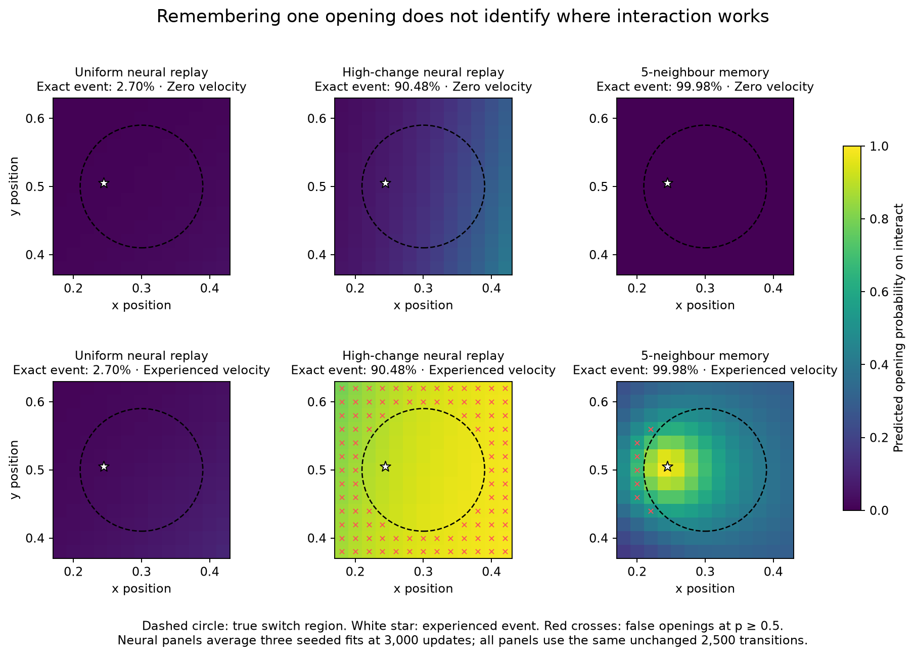

# 006 — Remembering an opening is not learning the switch

The existing neural architecture can fit the experienced opening when a generic
high-change sampler gives it more training exposure. That fit does not recover
the true condition for opening the door: the model predicts interaction effects
well outside the switch and depends strongly on an incidental velocity. A
nearest-neighbour memory model makes the distinction sharper: it recalls the
stored point almost perfectly while recognizing few nearby true openings.

This is **offline fitting on the complete, unchanged 2,500-transition dataset**
from study 003. It is not exploration evidence or a new sample-count baseline
for that online experiment. All simulator-generated evaluation transitions stay
outside training. The sampling rules, model seeds, budgets, probes and navigation
gate were [declared before fitting](../results/006-event-learning/PROTOCOL.md).

The neural candidates use the same three-member Gaussian/Bernoulli ensemble,
loss and optimizer. Uniform replay samples the whole dataset. High-change replay
draws half of each batch uniformly and half from the largest 1% of
`max(abs(next_state - state) / observation_scale)`. The rule uses all coordinates
and no door labels. The 25-transition tail contains the opening and 24 other
transitions. The memory candidate uses five nearest states with the same action,
normalized observation distance, inverse-distance weights, continuous residuals,
and empirical next-door values. It is a diagnostic baseline, not a proposed
architecture.

Results below use 3,000 optimizer updates, batches of 128 per member, and fixed
neural seeds 0, 1 and 2. Neural entries are means across the three fitted
ensembles; kNN is deterministic.

| Frozen candidate | Exact-event opening probability | True-opening recall | Outside-switch interact false positives | Continuous normalized MSE |
|---|---:|---:|---:|---:|
| Uniform neural replay | 2.70% | 0% | 0% | 8.06e-6 |
| High-change neural replay | 90.48% | 39.53% | 40.89% | 4.39e-5 |
| Five-neighbour memory | 99.98% | 9.90% | 1.17% | 6.02e-5 |

The classification threshold is the planner's existing 0.5 cutoff. Recall and
false positives use 6,084 controlled real transitions: a 13-by-13 position grid,
six velocity settings, all six actions, and the door initially closed. There are
414 true openings and 600 outside-switch interactions. All candidates have zero
false positives for the five wrong actions inside the switch region. Separate
motion probes cover both rooms and both door states; their binary error is
excluded from the continuous metric.

The map holds position separate from velocity. High-change models recognize
**none** of the true zero-velocity openings, but recognize **all** true openings
at the experienced velocity and at upward velocity `[0, 0.12]`. At the experienced
velocity they also predict openings throughout the outside region. They have
learned action specificity but not the spatial condition or velocity invariance.
The kNN model mostly recognizes positions near the recorded event at a similar
velocity; no velocity setting except the experienced one has nonzero recall.
The plotted neural probabilities average three fitted ensembles; individual
[uniform](../results/006-event-learning/uniform-spatial-by-seed.png) and
[high-change](../results/006-event-learning/high_change-spatial-by-seed.png)
maps are also retained.

The result is consistent across the three fits. Uniform exact-event probabilities
range from 2.25% to 3.03%; high-change probabilities range from 88.63% to 92.15%.
The opening appears 133–176 times per member under uniform sampling and
7,592–7,893 times under high-change sampling. At 1,000 updates, high-change
exact-event probabilities were already 71.74–73.34%; increasing point fit to
3,000 updates did not produce a correct switch region. The effect cannot be
attributed specifically to extra opening exposure alone: the sampler also
reweights 24 other transitions. Its continuous motion error increases as well.

Frozen navigation was run for candidates that passed the declared recall gate:
three planner seeds, 100 real steps from the default start and from the exact
experienced state, with the existing horizon-12 persistent planner. High-change
models succeed in **1/18** trials; kNN succeeds in **0/6**. Every default-start
trial fails. The single success starts at the experienced state, interacts on
its first step, and reaches the goal at step 45. Several failed traces press
against the closed door while imagining passage. Point recall consequently
does not establish reliable control, and the motion grid does not exhaustively
test contact errors or compounded rollouts. Uniform candidates did not meet
the declared gate and were not given new navigation trials.

The data contains 63 closed-door interactions, but only one occurs inside the
switch region and opens the door. The original run's 52 switch interactions
comprise that opening and 51 interactions after the door is already open. Resampling that
single positive can strengthen its influence; it cannot supply independent
evidence for the region or the irrelevance of velocity. These results distinguish
fitability of the observed point from general conditional interaction learning.
They do not isolate every architectural or optimization effect.

A fixed environmental time limit is a useful next collection condition. Resetting
every 500 or 1,000 steps would create repeated opportunities for natural
closed-to-open transitions without reward shaping or event-dependent resets.
At a matched real-step budget, 500-step episodes offer more initial encounters
but may remove far-room experience; 1,000-step episodes allow more traversal.
Keep the action RNG stream continuous across episodes, compare identical held-out
probes, and report opening diversity and spatial coverage together. Repeated
openings at varied states could test whether the spurious velocity condition
comes from the single-positive dataset. Resets alone would not establish
curiosity-driven discovery or repair contact modeling and planning.

The dataset hash remains unchanged. All twelve neural checkpoints, probe
predictions, the 24 full navigation trajectories, source snapshot, fixed protocol,
and [commands and checks](../results/006-event-learning/COMMANDS.md) are retained
in [`results/006-event-learning`](../results/006-event-learning/).
